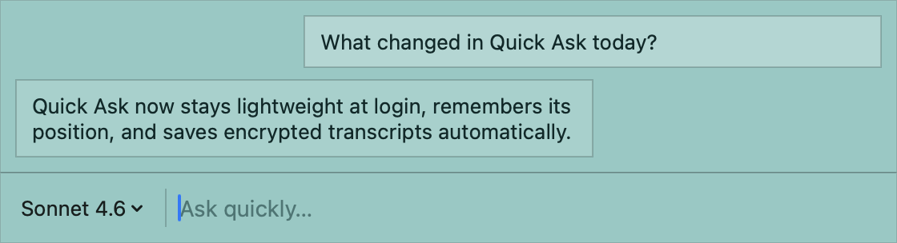

# Quick Ask

Quick Ask is a compact macOS chat panel for short prompts.

It lives above your other windows, keeps the input bar pinned while the conversation grows upward, supports Claude CLI login plus local Ollama models, and saves transcripts automatically with encrypted-at-rest storage.



## What It Does

- Toggle a floating panel with `Cmd+\`
- Open a separate history window with `Cmd+Shift+\`
- Start a fresh chat with `Cmd+N`
- Queue prompts while a reply is still streaming
- Steer to the next queued prompt with `Cmd+Enter`
- Restore earlier chats from encrypted saved history
- Pick a custom archive folder from `Settings…` in the model menu
- Switch between Claude CLI-backed models and installed Ollama models

## Requirements

- macOS
- Python 3
- Xcode command line tools
- Claude CLI for Claude-backed chat
- Ollama for local-model chat
- `openssl` and macOS Keychain access for transcript encryption

## Storage

Transcript saves are encrypted before they are written to disk.

- If Dropbox is available, Quick Ask stores transcripts in `local-llm-chat/sessions` inside Dropbox.
- If Dropbox is not available, Quick Ask falls back to `~/Library/Application Support/Quick Ask/sessions`.
- The encryption key is stored in macOS Keychain under the service name `local-chat-transcript-key`.
- You can override the transcript folder with `QUICK_ASK_SAVE_DIR`.
- You can also choose a custom archive folder in the app from the model menu `Settings…` screen.

## Build

From the project directory:

```zsh
./build-quick-ask
```

That script:

- builds `Quick Ask.app`
- installs it into `~/Applications`
- bundles the Python backend and shared helper module
- installs a LaunchAgent so the app starts at login

## Usage

1. Launch Quick Ask.
2. Press `Cmd+\` to show or hide the panel.
3. Type a prompt and press `Enter`.
4. Use the model menu to switch providers.
5. Open `Settings…` from the model menu if you want to change where encrypted archives are stored.
6. Press `Cmd+Shift+\` to browse and restore prior chats.

## Development

Run the UI suite with:

```zsh
python3 -m unittest -v tests/test_quick_ask_ui.py
```

The UI tests do not send real chat prompts to Claude or Ollama. They run the app in a test mode with stubbed generation so layout, queueing, history, and shortcut behavior can be verified without burning inference tokens.
